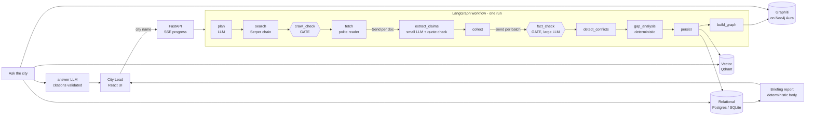

# CARDIO4Cities City Intelligence: Architecture Overview

## 1. The problem as I understand it

A City Lead is about to meet government and healthcare decision-makers in a city nobody on the team has
researched. They need to know the cardiovascular landscape, who matters, what already exists, and, just as
important, **what is not known**. The risk in automating this is not that the system finds too little. It is
that a fluent model states a national statistic as a city fact, invents a programme, or attributes an attitude
to a person, and the City Lead repeats it in the room.

So the design goal is not "a research agent". It is **a research pipeline in which nothing reaches the user
unless it can be traced to a source that permitted reading, a quote that exists in that source, and a second
model that failed to disprove it**, and in which absence of evidence is a reported result.

## 2. System at a glance

| Layer | Technology | Why |
|---|---|---|
| Orchestration | LangGraph 1.2 | Explicit graph with gates, `Send` fan-out for per-document and per-batch parallelism, reducers so parallel branches never overwrite each other, streamed progress events |
| LLM | gpt-oss 120B / 20B via Ollama Cloud, Groq as automatic fallback | Open-weight, zero cost. Routed by role: small model for volume extraction, large model for planning, verification and answers |
| Search | Serper (Google) → Tavily → Ollama web search → DuckDuckGo | Fallback chain with API-key pools and rotation; search is *discovery only* |
| Reading | own crawler: httpx + trafilatura + pypdf | So that *our* crawlability decision governs every byte we read |
| Relational | SQLAlchemy → Postgres (Neon) / SQLite | System of record and audit trail |
| Vector | Qdrant (cloud or embedded) + local ONNX embeddings | Semantic recall of verified claims and source passages |
| Graph | Graphiti on Neo4j Aura | Temporal knowledge graph of entities and relationships, queried at answer time |
| API / UI | FastAPI + SSE, React + TypeScript | Live progress; a UI organised around trust signals rather than chat |

## 3. Agent responsibilities and how they coordinate

| Node | Type | Responsibility | Failure behaviour |
|---|---|---|---|
| `plan` | LLM agent | Resolve city, country code, admin region, aliases; fixed six categories, city-specific queries; **records its assumptions** | retried 3× |
| `search` | code | Live search, de-duplicate, remember which queries surfaced each URL | provider fallback chain |
| `crawl_check` | **gate** | Platform terms → robots.txt (RFC 9309) → HEAD probe, *before* any fetch | denied sources are kept as "discovered, not extracted" |
| `fetch` | code | Per-domain rate limit, retries, size caps; official sources first when the cap binds | errors recorded per document |
| `extract_claims` | LLM agent, fan-out | Atomic claims with verbatim quote, geography level, year | **code** verifies the quote is in the source; failures go to `rejected_claims` |
| `fact_check` | **gate**, fan-out | Different model, different prompt, sees only claim + source excerpt. SUPPORTED / PARTIALLY / UNSUPPORTED / MISSING, plus geography correction | a skipped claim counts as MISSING, never as verified |
| `detect_conflicts` | LLM agent | Cross-source comparison of statistics; flags pairs, never picks a winner | non-fatal |
| `gap_analysis` | code | No evidence / national-only / single source / outdated / official sources we could not read | deterministic |
| `persist` | store | Relational audit trail + vector index | idempotent (deterministic ids) |
| `build_graph` | store | Verified relationship claims → Graphiti episodes; incremental per city | provenance saved per episode; rebuildable from SQL |

**Independence of the fact checker** is structural, not a prompt instruction: another model size, another
prompt whose only job is falsification, and no access to the extractor's confidence or reasoning.
**Consequences in the workflow:** UNSUPPORTED and MISSING claims are excluded from `verified_claim_ids`, so they
never reach the vector index, the graph, answers or the report. They stay in the relational store for audit and
are visible in the UI under "Claims we did not accept".

## 4. What lives where, and why

| Store | Contents | Question it answers |
|---|---|---|
| **Relational** | cities, runs (with plan + assumptions), every source with its crawl decision, every claim with quote, evidence window, verdict, rationale, models used, extractor vs corrected geography, conflicts, gaps, episode mapping | "Where did this come from?", "What did we reject and why?", filtering, counting, the report |
| **Vector** | verified claims (statement + quote) and the most relevant verbatim passages of each readable source | "What do we know that is *about* this?" when the wording differs |
| **Graph (Graphiti)** | typed entities (Organization, Programme, Policy, Place, Person, Facility, HealthCondition) and time-stamped relationships between them, one namespace per city | "Who runs / funds / partners with what, and how are they connected?" |

Deliberate exclusions: **statistics do not go into the graph** (a prevalence figure makes a poor entity and
pollutes relationship search); **rejected claims never go into the vector store or the graph**; **no fact lives
only in the vector store**, payloads carry ids back to SQL.

Traceability chain for a graph fact: `edge → episode uuid → claims.graph_episode_uuid → quote + evidence window → source → crawl decision`.

## 5. Retrieval at question time

`question → Graphiti hybrid search (BM25 + vector + graph traversal, no LLM) + Qdrant (verified claims, passages) + SQL (verdict, geography, source, gaps) → numbered evidence list → answer model`.

The answer model sees only the numbered evidence. Every sentence must cite `[En]`; citations that do not exist
are stripped and reported; evidence that is not city-level is labelled with its geography; passages are marked
"not fact-checked". If the evidence does not answer the question, the answer says so and returns the recorded
gaps. The Ask tab stays locked until `graph_status = ready`, so an answer can never bypass the knowledge graph.

Write path and read path are separate: research *writes* knowledge (minutes, once per city), questions *read*
it (seconds). Graph search itself takes about 0.2 s; an answer takes 3 to 8 s end to end.

## 6. The open design questions

| Question | Decision |
|---|---|
| What is "understanding a city"? | Six fixed categories a City Lead acts on: CVD burden, health system, programmes, policies, stakeholders, risks and gaps. Depth is bounded by a per-run document budget, breadth by the categories. |
| How is research planned? | One planner call adapts *queries* to the city (admin region, local bodies, national surveys). Categories are fixed so that cities are comparable. Assumptions are recorded and shown, never used as facts. |
| How are sources evaluated? | Domain-based tier at discovery (government, intergovernmental, academic, NGO, reference, news, commercial) drives fetch priority and is shown on every fact. Extraction quality is graded; navigation-only pages are never mined. |
| Human review before storage? | Not in the timebox. The fact-check gate is where a reviewer queue would attach, and the audit trail already holds everything a reviewer needs. |
| When is research sufficient? | It is budget-bounded, and insufficiency is *reported*: per-category gaps (none / national-only / single-source / outdated). A follow-up run for weak categories is the designed next step. |
| Conflicting information? | Never resolved silently. Both claims are kept, flagged `in_conflict`, shown together in the UI and report. |
| Institutional memory over time? | Claims have deterministic ids, so a re-run only ingests *new* verified claims. Graphiti edges carry `valid_at` / `invalid_at`, so a changed fact invalidates the old one rather than deleting it. The graph is rebuildable from SQL. |
| Modelling relationships? | Typed entities, free-text relationship facts, one `group_id` per city. Types carry no attributes because free LLM providers do not enforce schemas for Graphiti. |
| Facts vs assumptions? | Facts = verified claims with a quote. Assumptions = planner output, stored separately. Passages = verbatim, labelled unverified. Gaps = recorded absences. |
| Missing information? | First-class rows in `gaps`, plus "official sources we found but were not permitted to read". |

## 7. Trade-offs and what I cut

- **Honest bot identity over coverage.** We identify as a research bot and do not spoof a browser. Several
  publishers and government WAFs refuse us, costing roughly a third of discovered URLs. Spoofing would
  contradict the purpose of a crawlability agent.
- **RFC-strict robots handling.** Unreachable robots.txt means deny. Configurable, conservative by default.
- **Zero-cost stack.** Free LLM tiers do not enforce JSON schemas. Mitigations: schema-in-prompt + Pydantic
  validation + one repair attempt + provider fallback; types-only graph ontology.
- **Graph build is slow** (about 20 s per episode on free models). It runs after findings are already
  available, and only relationship claims are ingested, bundled per source.
- **Deterministic report body.** Only the executive summary is model-written, and it is citation-checked.
- **Cut:** JavaScript rendering, human review queue, multi-round research that re-plans from gaps,
  authentication, PDF export (HTML prints cleanly), scheduled re-research, evaluation harness with labelled
  claims. Each is a bounded addition to the existing structure rather than a redesign.

## 8. Measured behaviour (Nairobi, free tiers)

12 planned queries → 69 sources → 37 permitted → 19 readable documents → 80 claims with a located quote
(3 rejected by the quote check) → 71 verified, 9 not accepted by the fact checker, 8 geography corrections →
9 gaps → 45 graph relationships. Research 102 s; graph build about 5 min in the background; answers 3 to 8 s.
